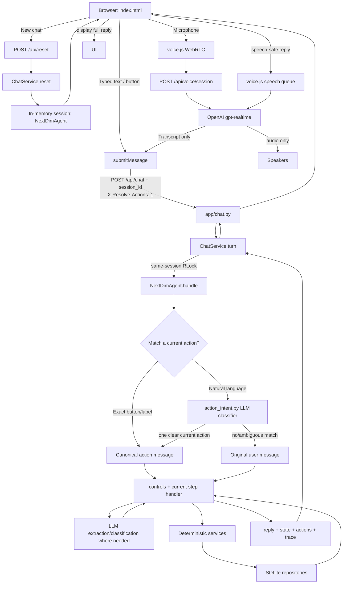
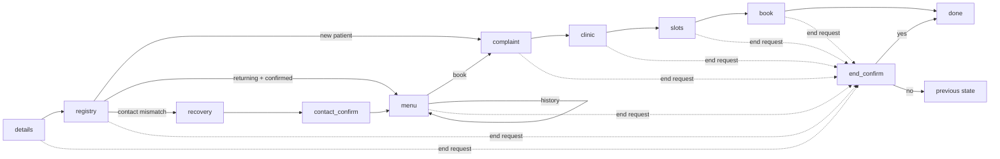

# VAST / NextDim architecture — v0.2.3

## Runtime flow

## Exact code path

1. `app/main.py` initializes SQLite and registers chat + voice routers.
2. `POST /api/reset` -> `services/chat.py:ChatService.reset()` -> `app/sessions.py:new_session()` -> `NextDimAgent.start()`.
3. Typed text, button messages, and voice transcripts all reach `submitMessage()` in `app/static/index.html`.
4. Voice uses `app/voice.py` only to establish WebRTC with `gpt-realtime`; Realtime does not own application decisions or tools.
5. Browser turns call `POST /api/chat` with `X-Resolve-Actions: 1`.
6. `ChatService.turn()` finds the session and holds the agent's re-entrant turn lock for the full turn.
7. `NextDimAgent.handle()` optionally calls `agents/nextdim/action_intent.py`:
   - exact current button payload/label -> deterministic canonical action;
   - clear paraphrase -> LLM may select only one currently visible canonical action;
   - ambiguous/new information -> original message continues unchanged.
8. `agents/nextdim/controls.py` handles lifecycle commands; otherwise `agents/nextdim/steps/HANDLERS` executes the current state.
9. Step handlers use structured LLM calls only for language interpretation and use deterministic services/tools for contacts, dates, clinics, availability, history, and booking.
10. Repositories persist patients/bookings in SQLite. Booking reservation is transaction-protected and rechecks slot occupancy before insert.
11. `/api/chat` returns `reply`, `step`, `actions`, trace events, booking/history data, and the same `session_id`.
12. The browser displays the full reply. TTS speaks a speech-safe version: normal answers are preserved; slot grids/buttons are summarized instead of narrated. Replay never calls `/api/chat`.

## Conversation state flow

Email codes are not part of this flow. `flow.verified` means **confirmed in the current chat**, not authenticated identity.
